# ePathshala System Flow Chart

## Complete System Architecture Flow

```mermaid
graph TB
    %% User Interface Layer
    subgraph "Frontend (React + Material-UI)"
        UI[User Interface]
        Login[Login Page]
        Dashboard[Dashboard Pages]
        Chat[Chat Interface]
        Exam[Exam Interface]
        Assign[Assignment Interface]
        Calendar[Calendar Interface]
    end

    %% API Gateway Layer
    subgraph "API Gateway"
        Router[React Router]
        AuthGuard[Protected Routes]
        API[API Service Layer]
    end

    %% Backend Services Layer
    subgraph "Backend Services (Spring Boot)"
        AuthController[Auth Controller]
        TeacherController[Teacher Controller]
        StudentController[Student Controller]
        ParentController[Parent Controller]
        AdminController[Admin Controller]
        ChatController[Chat Controller]
        ExamController[Exam Controller]
        FileController[File Controller]
    end

    %% Business Logic Layer
    subgraph "Business Logic Layer"
        AuthService[Auth Service]
        TeacherService[Teacher Service]
        StudentService[Student Service]
        ParentService[Parent Service]
        AdminService[Admin Service]
        ChatService[Chat Service]
        ExamService[Exam Service]
        NotificationService[Notification Service]
    end

    %% Data Access Layer
    subgraph "Data Access Layer"
        UserRepo[User Repository]
        StudentRepo[Student Repository]
        TeacherRepo[Teacher Repository]
        AttendanceRepo[Attendance Repository]
        GradeRepo[Grade Repository]
        AssignmentRepo[Assignment Repository]
        ExamRepo[Exam Repository]
        ChatRepo[Chat Repository]
    end

    %% Database Layer
    subgraph "Database (MySQL)"
        Users[(Users Table)]
        Students[(Students Table)]
        Teachers[(Teachers Table)]
        Parents[(Parents Table)]
        Attendance[(Attendance Table)]
        Grades[(Grades Table)]
        Assignments[(Assignments Table)]
        Submissions[(Submissions Table)]
        Exams[(Exams Table)]
        Questions[(Questions Table)]
        ChatMessages[(Chat Messages Table)]
        Notifications[(Notifications Table)]
    end

    %% External Services
    subgraph "External Services"
        JWT[JWT Authentication]
        WebSocket[WebSocket Server]
        FileStorage[File Storage]
        EmailService[Email Service]
    end

    %% User Flow Connections
    UI --> Router
    Router --> AuthGuard
    AuthGuard --> API
    API --> AuthController
    API --> TeacherController
    API --> StudentController
    API --> ParentController
    API --> AdminController
    API --> ChatController
    API --> ExamController

    %% Controller to Service Connections
    AuthController --> AuthService
    TeacherController --> TeacherService
    StudentController --> StudentService
    ParentController --> ParentService
    AdminController --> AdminService
    ChatController --> ChatService
    ExamController --> ExamService

    %% Service to Repository Connections
    AuthService --> UserRepo
    TeacherService --> TeacherRepo
    TeacherService --> AttendanceRepo
    TeacherService --> GradeRepo
    TeacherService --> AssignmentRepo
    StudentService --> StudentRepo
    StudentService --> AssignmentRepo
    StudentService --> GradeRepo
    ParentService --> ParentRepo
    AdminService --> UserRepo
    ChatService --> ChatRepo
    ExamService --> ExamRepo

    %% Repository to Database Connections
    UserRepo --> Users
    StudentRepo --> Students
    TeacherRepo --> Teachers
    ParentRepo --> Parents
    AttendanceRepo --> Attendance
    GradeRepo --> Grades
    AssignmentRepo --> Assignments
    AssignmentRepo --> Submissions
    ExamRepo --> Exams
    ExamRepo --> Questions
    ChatRepo --> ChatMessages

    %% External Service Connections
    AuthService --> JWT
    ChatService --> WebSocket
    FileController --> FileStorage
    NotificationService --> EmailService

    %% Styling
    classDef frontend fill:#e1f5fe
    classDef backend fill:#f3e5f5
    classDef database fill:#e8f5e8
    classDef external fill:#fff3e0

    class UI,Login,Dashboard,Chat,Exam,Assign,Calendar,Router,AuthGuard,API frontend
    class AuthController,TeacherController,StudentController,ParentController,AdminController,ChatController,ExamController,FileController,AuthService,TeacherService,StudentService,ParentService,AdminService,ChatService,ExamService,NotificationService,UserRepo,StudentRepo,TeacherRepo,AttendanceRepo,GradeRepo,AssignmentRepo,ExamRepo,ChatRepo backend
    class Users,Students,Teachers,Parents,Attendance,Grades,Assignments,Submissions,Exams,Questions,ChatMessages,Notifications database
    class JWT,WebSocket,FileStorage,EmailService external
```

## User Authentication Flow

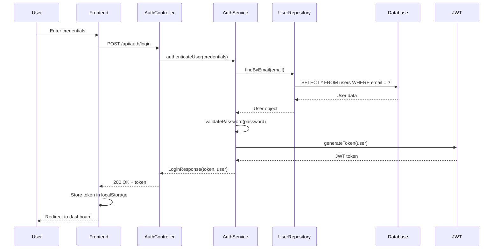

## Teacher Dashboard Flow

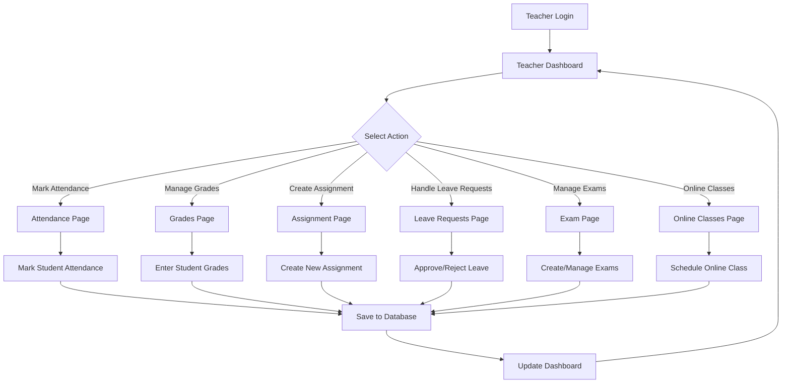

## Student Dashboard Flow

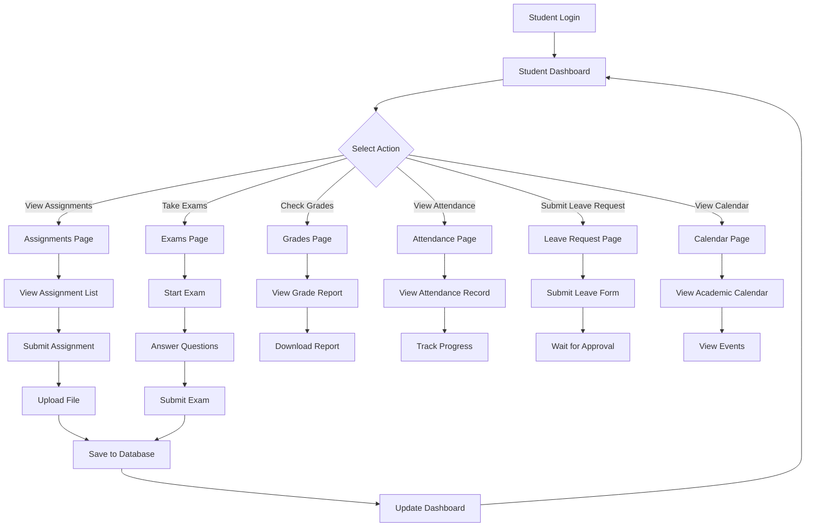

## Real-time Chat Flow

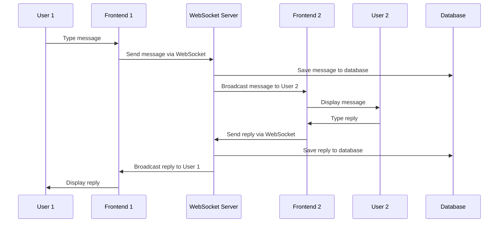

## Exam Management Flow

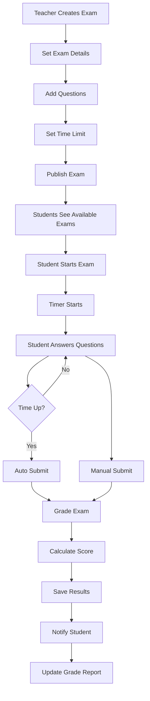

## File Upload Flow

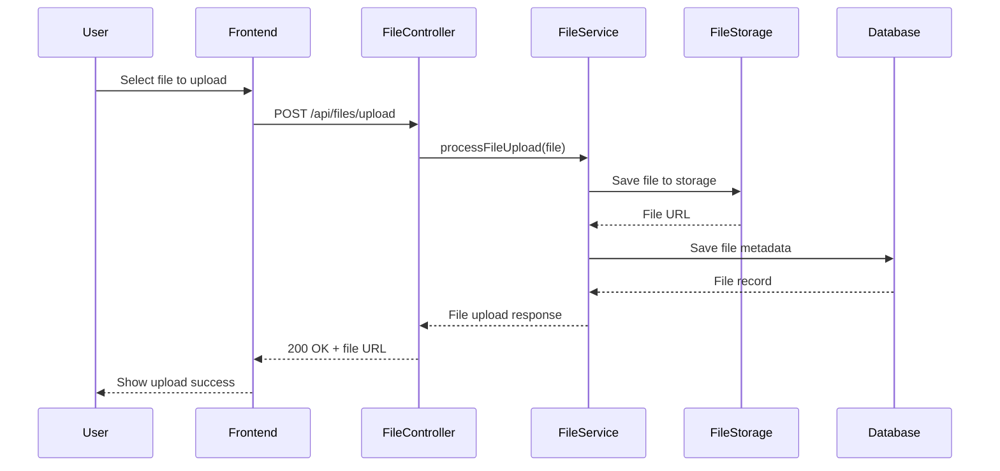

## Notification System Flow

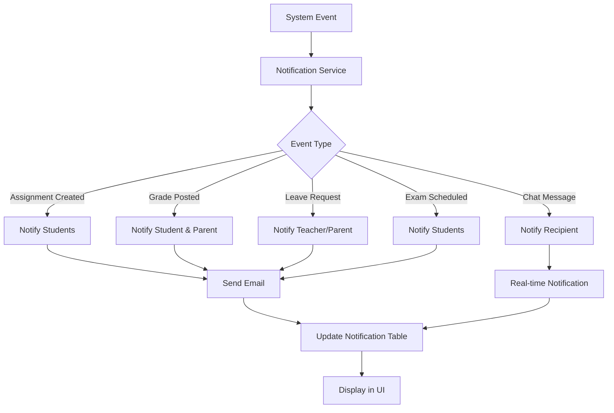

## Database Schema Relationships

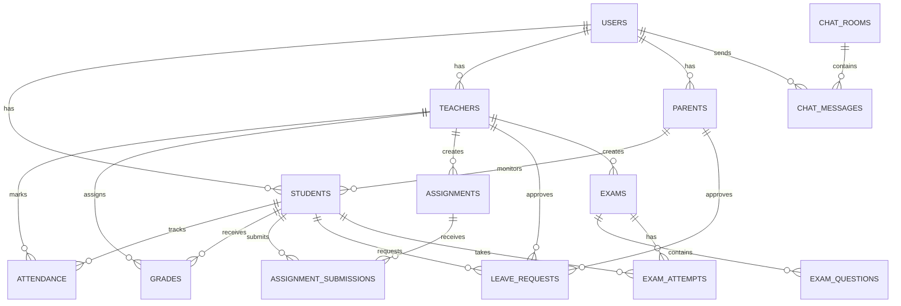

## Security Flow

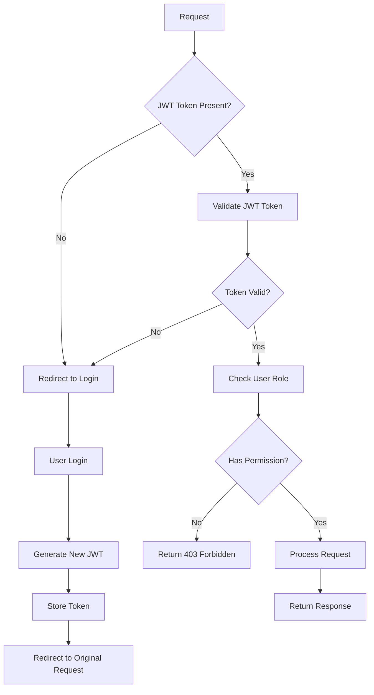

## System Deployment Architecture

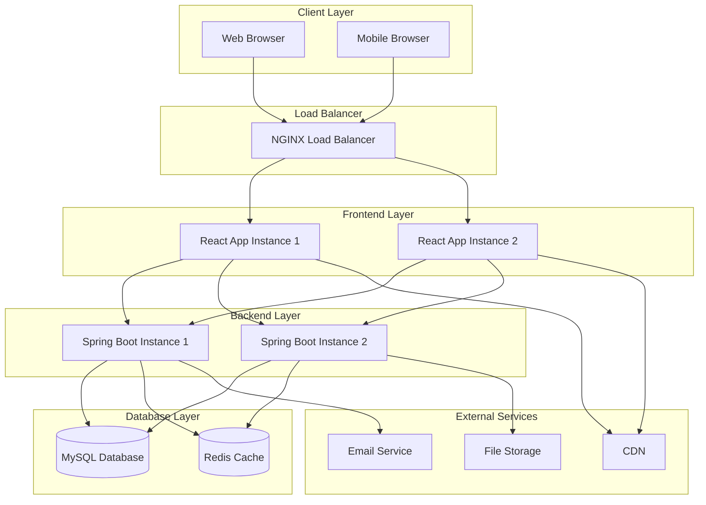

## Error Handling Flow

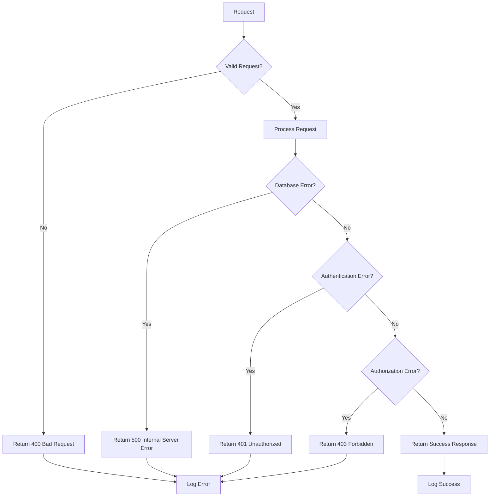

This comprehensive flow chart demonstrates the complete architecture and data flow of the ePathshala system, covering authentication, user interactions, real-time features, and system deployment.