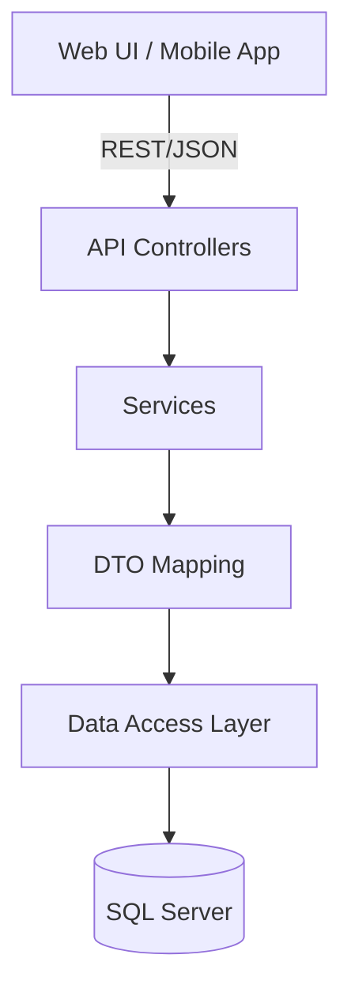
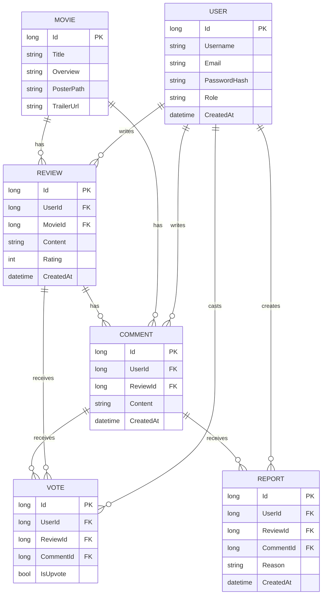

<p align="center">
  
  
  
</p>

# 🎬 MovieMo: Enterprise-Grade Movie Review Platform

MovieMo is a robust, scalable .NET 6 Web API for managing movies, user reviews, comments, votes, and moderation. Designed for production environments, it features JWT authentication, layered architecture, and modern best practices.

---

## Table of Contents
- [Features](#features)
- [Architecture](#architecture)
- [Database Schema](#database-schema)
- [User Roles & Permissions](#user-roles--permissions)
- [API Reference](#api-reference)
- [Usage Examples](#usage-examples)
- [Deployment & Configuration](#deployment--configuration)
- [Testing & Quality](#testing--quality)
- [Security](#security)
- [Contributing](#contributing)
- [License](#license)

---

## 🚀 Features
| Feature                | Description                                             |
|------------------------|---------------------------------------------------------|
| User Auth              | Secure JWT authentication & role-based access           |
| Movie CRUD             | Admins manage movie catalog, users browse/review        |
| Reviews & Ratings      | Users post, edit, and delete reviews with ratings       |
| Comments               | Threaded discussions on movies and reviews              |
| Voting                 | Like/dislike system for comments and reviews            |
| Reporting              | Users report inappropriate content                      |
| API Docs               | Swagger/OpenAPI for live API exploration                |
| Extensible             | Service/repository pattern, DTOs, and clean layering    |

---

## 🏗️ Architecture



> **Note:** Mermaid diagrams are supported natively on GitHub. If you do not see diagrams, ensure GitHub's Markdown rendering supports Mermaid for your repository.

---

## 🗄️ Database Schema



> **Note:** Mermaid ER diagrams are supported in GitHub Markdown. If you do not see diagrams, ensure Mermaid is enabled for your repository.

---

## 👥 User Roles & Permissions

| Role   | Movies | Reviews | Comments | Votes | Reports | Users |
|--------|--------|---------|----------|-------|---------|-------|
| Admin  | CRUD   | CRUD    | CRUD     | All   | All     | All   |
| User   | Read   | CRUD    | CRUD     | Cast  | Create  | Self  |
| Guest  | Read   | Read    | Read     | -     | -       | -     |

---

## 📚 API Reference

### Auth
- `POST /api/auth/register` — Register
- `POST /api/auth/login` — Login & get JWT

### Movies
- `GET /api/movies` — List all movies
- `GET /api/movies/{id}` — Get movie details
- `POST /api/movies` — Add movie (Admin)
- `PUT /api/movies/{id}` — Edit movie (Admin)
- `DELETE /api/movies/{id}` — Delete movie (Admin)

### Reviews
- `GET /api/movies/{movieId}/reviews` — List reviews for a movie
- `POST /api/movies/{movieId}/reviews` — Add review
- `PUT /api/reviews/{id}` — Edit review
- `DELETE /api/reviews/{id}` — Delete review

### Comments
- `GET /api/reviews/{reviewId}/comments` — List comments
- `POST /api/reviews/{reviewId}/comments` — Add comment
- `DELETE /api/comments/{id}` — Delete comment

### Voting
- `POST /api/reviews/{id}/vote` — Upvote/downvote review
- `POST /api/comments/{id}/vote` — Upvote/downvote comment

### Reports
- `POST /api/reviews/{id}/report` — Report review
- `POST /api/comments/{id}/report` — Report comment

---

## 📦 Usage Examples

### Register User
```http
POST /api/auth/register
Content-Type: application/json
{
  "username": "john_doe",
  "email": "john@example.com",
  "password": "StrongPassw0rd!"
}
```

### Authenticated Request
```http
GET /api/movies
Authorization: Bearer <your-jwt-token>
```

### Create Review
```http
POST /api/movies/1/reviews
Authorization: Bearer <jwt>
Content-Type: application/json
{
  "content": "Amazing movie!",
  "rating": 5
}
```

---

## ⚙️ Deployment & Configuration

1. **Clone the repo**
   ```bash
   git clone https://github.com/yourusername/moviemo.git
   cd moviemo
   ```
2. **Configure Environment**
   - Edit `appsettings.json`:
     ```json
     {
       "ConnectionStrings": {
         "DefaultConnection": "Server=localhost;Database=MovieMo;Trusted_Connection=True;"
       },
       "AppSettings": {
         "Issuer": "MoviemoAPI",
         "Audience": "MoviemoUsers",
         "Token": "your-very-strong-secret-key"
       }
     }
     ```
3. **Database Migration**
   ```bash
   dotnet ef database update
   ```
4. **Run the API**
   ```bash
   dotnet run
   ```
5. **Swagger UI**
   - Visit: `https://localhost:5001/swagger`

---

## 🧪 Testing & Quality
- **Unit/Integration Tests**: Add with xUnit, Moq, and in-memory DB
- **Linting**: StyleCop or Roslyn analyzers
- **CI/CD**: GitHub Actions or Azure Pipelines (build, test, deploy)
- **Code Coverage**: Use Coverlet or ReportGenerator

---

## 🔒 Security
- JWT authentication with token validation
- Passwords hashed (never stored in plain text)
- Role-based access control
- Input validation and anti-forgery
- CORS policy for frontend integration
- Secure secrets in environment variables

---

## 🏆 Best Practices
- Clean separation: Controllers → Services → Data
- Use DTOs for all API contracts
- Exception handling middleware
- Logging (Serilog, NLog, or built-in)
- Swagger for API documentation
- Use migrations for DB changes
- Write tests for all business logic
- Follow SOLID and DRY principles

---

## 🤝 Contributing
1. Fork the repository
2. Create a branch: `git checkout -b feature/your-feature`
3. Commit changes: `git commit -m 'Add feature'`
4. Push: `git push origin feature/your-feature`
5. Open a Pull Request

---

## 📄 License
MIT License. See [LICENSE](LICENSE).

---

## 🙏 Acknowledgments
- Built with ❤️ using .NET 6.0
- Thanks to all contributors and the OSS community
- [Mermaid.js](https://mermaid-js.github.io/) for diagrams

