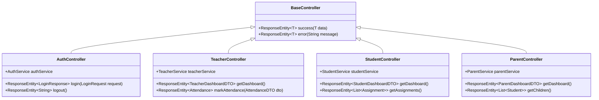
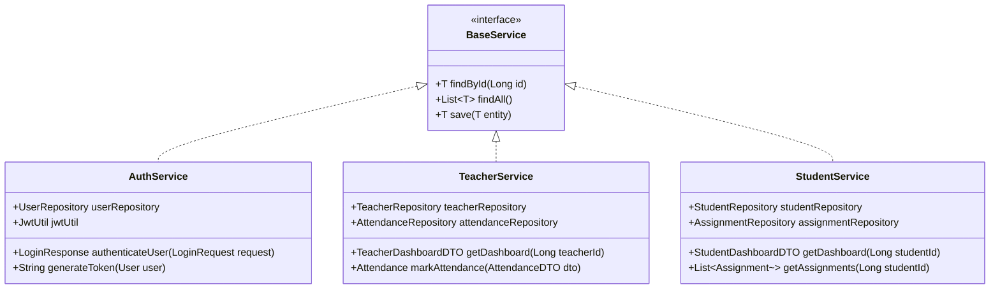

# ePathshala Simple Class Diagram

  

## Core Entities

  

```mermaid

classDiagram

    class User {

        +Long id

        +String email

        +String password

        +String firstName

        +String lastName

        +Role role

        +authenticate(password)

        +updateProfile(profileData)

    }

  

    class Student {

        +Long id

        +User user

        +String rollNumber

        +String className

        +getAttendance()

        +getGrades()

    }

  

    class Teacher {

        +Long id

        +User user

        +String employeeId

        +String qualification

        +markAttendance(studentId, date, status)

        +addGrade(studentId, subject, grade)

    }

  

    class Parent {

        +Long id

        +User user

        +String relationship

        +getChildProgress(studentId)

    }

  

    class Attendance {

        +Long id

        +Student student

        +Teacher teacher

        +LocalDate date

        +AttendanceStatus status

    }

  

    class Grade {

        +Long id

        +Student student

        +Teacher teacher

        +String subject

        +Double marks

        +calculateGrade()

    }

  

    class Assignment {

        +Long id

        +Teacher teacher

        +String title

        +String description

        +LocalDateTime dueDate

    }

  

    User ||--o{ Student : "has"

    User ||--o{ Teacher : "has"

    User ||--o{ Parent : "has"

    Student ||--o{ Attendance : "tracks"

    Student ||--o{ Grade : "receives"

    Teacher ||--o{ Attendance : "marks"

    Teacher ||--o{ Grade : "assigns"

    Teacher ||--o{ Assignment : "creates"

```

  

## Controllers

  



  

## Services

  

