# ePathshala Class Diagram - Part 1: Core Entities & Controllers

  

## Core Entity Classes

  

```mermaid

classDiagram

    %% Base User Entity

    class User {

        +Long id

        +String email

        +String password

        +String firstName

        +String lastName

        +Role role

        +String phoneNumber

        +LocalDateTime createdAt

        +LocalDateTime updatedAt

        +boolean isActive

        +authenticate(password)

        +updateProfile(profileData)

        +deactivate()

    }

  

    %% Role Enum

    class Role {

        <<enumeration>>

        ADMIN

        TEACHER

        STUDENT

        PARENT

    }

  

    %% Student Entity

    class Student {

        +Long id

        +User user

        +String rollNumber

        +String className

        +String section

        +Parent parent

        +LocalDate dateOfBirth

        +String address

        +String emergencyContact

        +getAttendance()

        +getGrades()

        +getAssignments()

        +submitAssignment(assignmentId, file)

        +requestLeave(leaveRequest)

    }

  

    %% Teacher Entity

    class Teacher {

        +Long id

        +User user

        +String employeeId

        +String qualification

        +String specialization

        +String department

        +LocalDate joiningDate

        +String experience

        +markAttendance(studentId, date, status)

        +addGrade(studentId, subject, grade)

        +createAssignment(assignmentData)

        +approveLeaveRequest(requestId, status)

        +createExam(examData)

    }

  

    %% Parent Entity

    class Parent {

        +Long id

        +User user

        +String relationship

        +String occupation

        +String address

        +List~Student~ children

        +getChildProgress(studentId)

        +getChildAttendance(studentId)

        +approveLeaveRequest(requestId)

        +getNotifications()

    }

  

    %% Academic Entities

    class Attendance {

        +Long id

        +Student student

        +Teacher teacher

        +LocalDate date

        +AttendanceStatus status

        +String remarks

        +LocalDateTime markedAt

        +markAttendance(status, remarks)

        +updateAttendance(status, remarks)

    }

  

    class AttendanceStatus {

        <<enumeration>>

        PRESENT

        ABSENT

        LATE

        HALF_DAY

    }

  

    class Grade {

        +Long id

        +Student student

        +Teacher teacher

        +String subject

        +Double marks

        +String grade

        +String remarks

        +LocalDate examDate

        +LocalDateTime createdAt

        +calculateGrade()

        +updateGrade(newMarks)

    }

  

    class Assignment {

        +Long id

        +Teacher teacher

        +String title

        +String description

        +String subject

        +String className

        +LocalDateTime dueDate

        +String fileUrl

        +AssignmentStatus status

        +LocalDateTime createdAt

        +createAssignment(data)

        +updateAssignment(data)

        +deleteAssignment()

        +getSubmissions()

    }

  

    class AssignmentStatus {

        <<enumeration>>

        DRAFT

        PUBLISHED

        CLOSED

    }

  

    class AssignmentSubmission {

        +Long id

        +Assignment assignment

        +Student student

        +String fileUrl

        +LocalDateTime submittedAt

        +SubmissionStatus status

        +String remarks

        +Double score

        +submitAssignment(file)

        +updateSubmission(file)

        +gradeSubmission(score, remarks)

    }

  

    class SubmissionStatus {

        <<enumeration>>

        SUBMITTED

        LATE

        GRADED

        OVERDUE

    }

  

    %% Leave Management

    class LeaveRequest {

        +Long id

        +Student student

        +Teacher teacher

        +Parent parent

        +LocalDate startDate

        +LocalDate endDate

        +String reason

        +LeaveType type

        +RequestStatus status

        +String remarks

        +LocalDateTime createdAt

        +submitRequest()

        +approveRequest(remarks)

        +rejectRequest(remarks)

    }

  

    class LeaveType {

        <<enumeration>>

        SICK_LEAVE

        CASUAL_LEAVE

        EMERGENCY_LEAVE

        OTHER

    }

  

    class RequestStatus {

        <<enumeration>>

        PENDING

        APPROVED

        REJECTED

        CANCELLED

    }

  

    %% Relationships

    User ||--o{ Student : "has"

    User ||--o{ Teacher : "has"

    User ||--o{ Parent : "has"

    Student ||--o{ Attendance : "tracks"

    Student ||--o{ Grade : "receives"

    Student ||--o{ AssignmentSubmission : "submits"

    Student ||--o{ LeaveRequest : "requests"

    Teacher ||--o{ Attendance : "marks"

    Teacher ||--o{ Grade : "assigns"

    Teacher ||--o{ Assignment : "creates"

    Teacher ||--o{ LeaveRequest : "approves"

    Parent ||--o{ Student : "monitors"

    Parent ||--o{ LeaveRequest : "approves"

    Assignment ||--o{ AssignmentSubmission : "receives"

```

  

## Controller Classes

  


# ePathshala Class Diagram - Part 2: Services, Repositories & Frontend

  

## Service Layer Classes

  


  

## Repository Layer Classes

  


  

## DTO Classes

```mermaid

classDiagram

    %% Authentication DTOs

    class LoginRequest {

        +String email

        +String password

        +Role role

    }

  

    class LoginResponse {

        +String token

        +User user

        +String message

    }

  

    class ForgotPasswordRequest {

        +String email

    }

  

    class ResetPasswordRequest {

        +String email

        +String otp

        +String newPassword

    }

  

    %% Dashboard DTOs

    class TeacherDashboardDTO {

        +Long teacherId

        +String teacherName

        +List~Attendance~~ recentAttendance

        +List~Assignment~~ recentAssignments

        +List~LeaveRequest~~ pendingLeaveRequests

        +Map~String, Integer~~ attendanceStats

        +Map~String, Double~~ gradeStats

    }

  

    class StudentDashboardDTO {

        +Long studentId

        +String studentName

        +List~Assignment~~ pendingAssignments

        +List~Grade~~ recentGrades

        +List~Attendance~~ recentAttendance

        +List~Exam~~ upcomingExams

        +Map~String, Double~~ subjectAverages

    }

  

    class ParentDashboardDTO {

        +Long parentId

        +String parentName

        +List~Student~~ children

        +Map~Long, ChildProgressDTO~~ childProgress

        +List~Notification~~ recentNotifications

        +List~LeaveRequest~~ pendingApprovals

    }

  

    class AdminDashboardDTO {

        +Long totalStudents

        +Long totalTeachers

        +Long totalParents

        +Map~String, Integer~~ userStats

        +List~AcademicCalendar~~ upcomingEvents

        +Map~String, Integer~~ systemStats

    }

  

    %% Academic DTOs

    class AttendanceDTO {

        +Long studentId

        +Long teacherId

        +LocalDate date

        +AttendanceStatus status

        +String remarks

    }

  

    class GradeDTO {

        +Long studentId

        +Long teacherId

        +String subject

        +Double marks

        +String remarks

        +LocalDate examDate

    }

  

    class AssignmentDTO {

        +Long teacherId

        +String title

        +String description

        +String subject

        +String className

        +LocalDateTime dueDate

        +MultipartFile file

    }

  

    class LeaveRequestDTO {

        +Long studentId

        +LocalDate startDate

        +LocalDate endDate

        +String reason

        +LeaveType type

    }

  

    %% Exam DTOs

    class ExamDTO {

        +Long teacherId

        +String title

        +String description

        +String subject

        +LocalDateTime startTime

        +LocalDateTime endTime

        +int duration

        +int totalMarks

        +ExamStatus status

    }

  

    class ExamQuestionDTO {

        +String question

        +String optionA

        +String optionB

        +String optionC

        +String optionD

        +String correctAnswer

        +int marks

        +QuestionType type

    }

  

    class ExamSubmissionDTO {

        +Long examId

        +Long studentId

        +List~ExamAnswerDTO~~ answers

        +LocalDateTime submittedAt

    }

  

    %% Chat DTOs

    class ChatMessageDTO {

        +Long senderId

        +Long receiverId

        +String message

        +MessageType type

        +String fileUrl

    }

  

    class ChatRoomDTO {

        +String name

        +List~Long~ participantIds

        +ChatRoomType type

    }

```

  



  

## Frontend Component Classes

  


  

## Configuration & Utility Classes

  


  

This comprehensive class diagram in two parts provides a complete view of the ePathshala system architecture, including:

  

**Part 1:**

- Core entities and their relationships

- Controller layer with all REST endpoints

- Authentication and authorization flow

  

**Part 2:**

- Service layer with business logic

- Repository layer for data access

- DTOs for data transfer

- Frontend React components

- Configuration and utility classes

  

The diagrams show the complete object-oriented design of the system, making it easy to understand the relationships between different components and how they interact with each other.